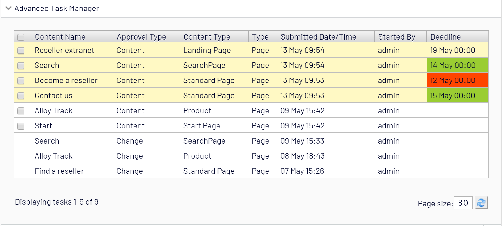

# Update 2.0.0

* Change Approval tasks will show along with the Content Approval tasks.
* Support for all content type tasks in CMS. Now editors can view, approve and publish, Episerver Forms, ImageData & MediaData. 
* Bug fixes for pagination and performance improvements.

# Advanced Task Manager
 
Currently, the User notification and Tasks (Awaiting Review) are disconnected and provide very basic information to the editors.


The idea behind this project is two-fold. The first purpose is to build a more versatile Approval Sequence task management gadget (for Content & Change Awaiting Review tasks) to extend the information available to the editors. The second purpose is to combine user notifications with tasks and empower Approvers to act on their tasks within a single interface.  



The gadget provides the following information about the task to the Editor:
* Content Name
* Approval Type (only if Change Approval tasks are available)
* Content Type
* Type
* Submitted Date/Time
* Started By
* Deadline (optional)

The list of current features is:
* [Task ordering](#task-ordering)
* [Deadline field for the content approval](#deadline-field-for-the-content-approval-optional)
* [User notifications associated with the task](#user-notifications-associated-with-the-task)
* [Approve entire approval sequence](#approve-entire-approval-sequence)
* [Publish content after approval](#publish-content-after-approval)

Some features are disabled by default, but you can decide which ones are enabled by Configuring features.

## Task ordering

The gadget gives editors an option to sort through all the tasks with status Awaiting Review by the following columns:
* Order tasks by time/date
* Order tasks by approval type
* Order tasks by content type
* Order tasks by type
* Order tasks by category
* Order tasks by a user who submitted the request
* Order task by the deadline


## Deadline field for the approval sequence (Optional)

![Deadline field for the approval sequence] (assets/docsimages/image0081.png)

The deadline property is a date/time property that allows editors to set priority against the content (Page or Block) so that the Approvers are aware of the priority ahead of approval.

The deadline property functionality is disabled by default and can be enabled (if required) by adding the following **<appSettings>** element of the **Web.config**.


By enabling the ```Content approval deadline``` The property ```Content approval deadline``` will be added in all  PageTyes and BlockTypes under ```Content Approval``` Tab.


The deadline property has three states in the gadget:

* **Warning**

The ```Warning``` state, highlighted in green informs approvers of the task that needs attention to be approved. The duration of the ```Warning``` state is 4 days by default. It means if the content deadline is within 4 days ```deadline row``` will be highlighted in green.

You can set the duration of the ```Warning``` state by adding the **<appSettings>** element of the **Web.config**.


* **Danger**

The ```Danger``` state highlighted in red indicates the deadline date/time has passed.

* **Normal**

The ```Normal``` state is not represented by any color as it shows there is still time for Approvers to prioritize the task.

Setting the **<appSettings> ATM:EnableContentApprovalDeadline** element of the **Web.config** to **false** will hide the property and Tab from CMS editor UI.
 
If you want to delete the property from the CMS, add the following **<appSettings>** element of the **Web.config**


Please note that the **ATM:DeleteContentApprovalDeadlineProperty** will only trigger if **ATM:EnableContentApprovalDeadline** element is set to **false**.

## User notifications associated with the task
 

 
The gadget allows user notifications associated with the task to be ‘read’ and enable the notification icon to be more useful as opposed to accumulating notifications.

When the editors open or refresh the gadget, all user tasks with unread notifications are highlighted and the notifications then are marked as read automatically.  It means in the editor notification section the notifications will be marked as read. 
 

 
## Approve entire approval sequence (only for Content Approval)
 
The gadget informs the editor to approve the entire Content Approval Sequence of single or multiple contents. Comment field is required.
 

 
## Publish content after approval
 
If the editor has published rights for the content approval, the option for ```Publish selected content after approval``` will be enabled that allows the editor to publish the content after approval.

If the editor has published rights for some of the content after approving all content then only content the editor can publish will be published. The warning messages will appear against the content which the editor cannot publish.


## Configuring features

To turn on or off one or more features, use the following **<appSettings>** elements of **Web.config**. By way of an example set false on the feature that should not be available.


## Install 

```Install-Package AdvancedTaskManager```

https://nuget.episerver.com/package/?id=AdvancedTaskManager

Add the ```Advanced Task Manager``` gadget in the dashboard


## Contributing

If you can help please do so by contributing to the package! Reach out package maintainer for additional details if needed.